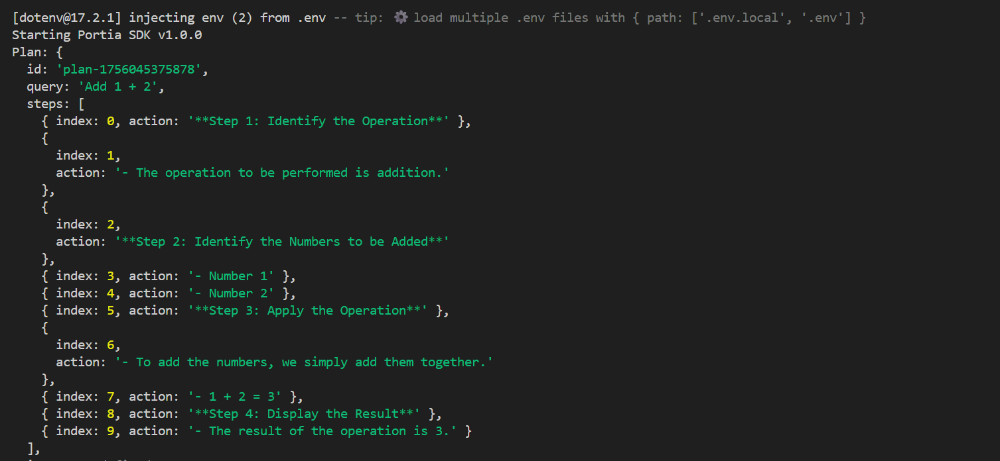
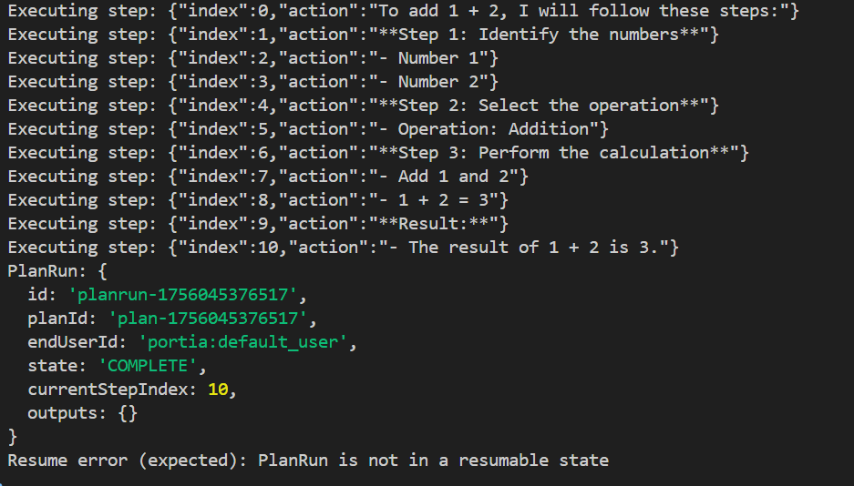

# Portia TypeScript SDK  

A **TypeScript SDK** for [Portia](https://docs.portialabs.ai/), built to make it simple for developers to integrate Portia’s planning and execution engine into their applications.  

 
---

## 📖 Documentation  

 Full documentation with guides, workflow, and explaonation of code is available here:  
 [Portia TypeScript SDK Docs](https://angle-hack-docs.vercel.app/docs/getting-started)  

---

##  Features  

-  TypeScript-first — type-safe interfaces for Plans, PlanRuns, Tools, and EndUsers  
-  Custom Tools — register your own tools or use the default registry  
-  Plan & Run — break down queries into structured steps and execute them  
-  End User Context — track execution for multiple users  
-  In-memory Storage — simple, extensible persistence  
-  Telemetry + Hooks — plug into execution lifecycle and metrics  

---

## Why This SDK?
- Portia currently lacks a Node.js/TypeScript SDK
- Enables millions of JS/TS developers to integrate Portia seamlessly
- Provides a modern DX: async/await, strong typing, easy setup
- Makes Portia accessible for hackers, startups, and enterprises

# working SDK with core functionality of python based SDK

  

  

